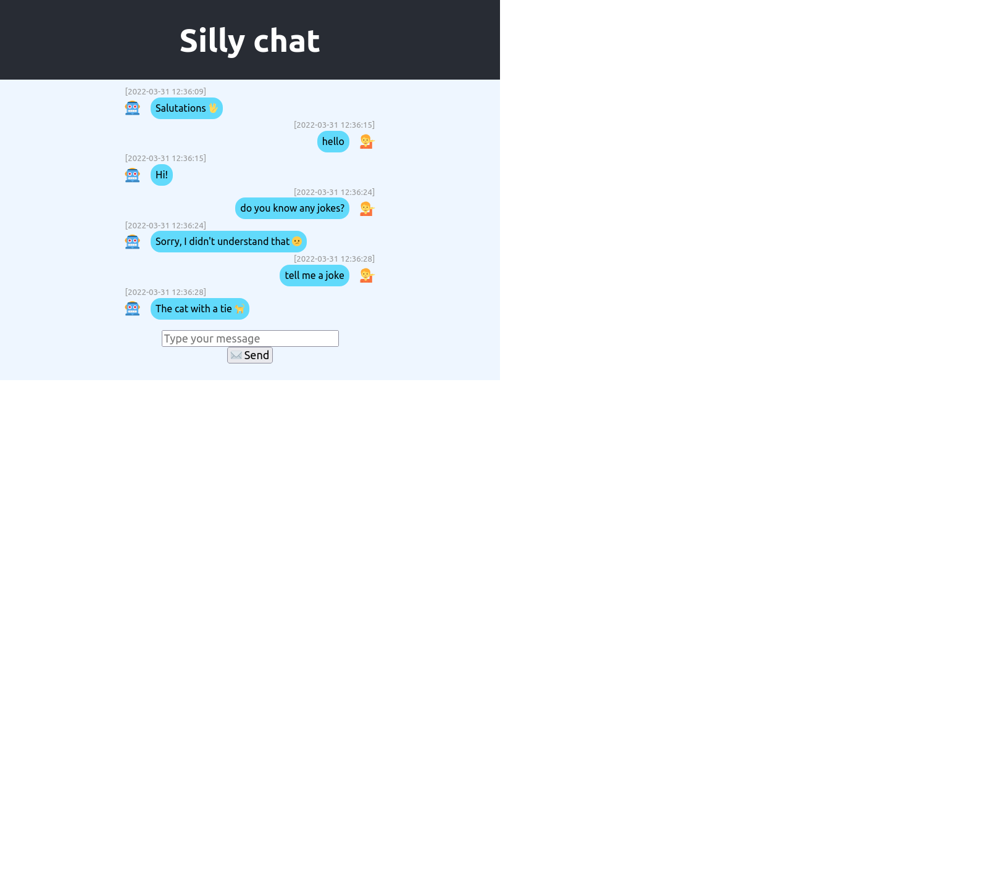
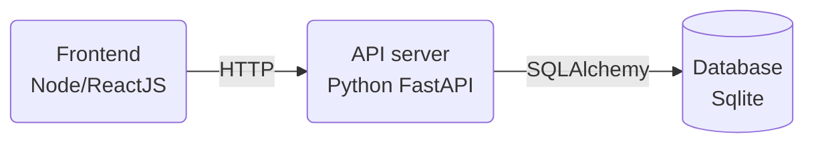

# Infrastructure engineer technical assignment


## Problem description

This is a relatively simple prototype chatbot app someone has created. It consists of a Python backend API server, a SQL database that the backend reads and writes to, and a ReactJS frontend that talks to the backend via HTTP.


However, the app author only knows how to develop on their local computer, your task is __preparing and getting the app into production on the internet.__

Some parts of the application stack might be unfamiliar to you, you can make assumptions about things you are unsure about and comment on it.




## Scope and considerations
We suggest spending no more than 4 hours on this assignment. 

The task can be completed either by actually deploying the code to some service you are familiar with, or by writing up an action plan, or a mix of both. It is ideal to see at least some code, working or not. But the most important thing is for us to see how you plan your steps, and get an overall picture of what pipelines you would wish to set up.

Some suggested steps to get you started:
- Consider containerization of the apps
- Consider where/how to host the apps
- Consider how to automate deployment, judge the size and complexity of the application
What would the action plan be if you had more time, improvements, future pitfall, etc

To remind you, these are relevant technologies from the job description:
- Kubernetes and containers.
- Google Cloud Platform, AWS or other cloud platforms.
- Terraform or other configuration management systems to allow working with infrastructure as code.
- CircleCI or other CI/CD systems.
- GNU/Linux using Debian/Ubuntu or Fedora/RHEL/CentOS.
- Shell scripting.
- PostgreSQL or other SQL databases.
- MongoDB or other NoSQL databases.
- Elasticsearch

## Delivery
Once done please share your assignment answer at least 24 hours before the technical interview so that we can have a chance to prepare as well. Sharing can be done either by inviting us to a git repo, or zipping up the files and sending by email. 

Good luck! 🚀️


## Local setup

The versions of Python and NodeJS that need to be installed on the system are listed in `.tool-versions`.

The database is just a `sqlite` file in the filesystem.
When developing locally the Python app handles access, so there is no need to run the DB as a separate process.
But this may be a poor choice of database for production,
and it might be necessary to migrate the data into some other DB.

#### Backend
The backend uses the `pipenv` package manager, which should be installed for the global python with `pip install --user pipenv`.

To install Python app dependencies locally:
```shell
pipenv sync
```

To run the backend from the project root:
```shell
pipenv run uvicorn backend.app:app --reload
```

#### Frontend
The frontend app uses `npm` to install the app dependencies in the `frontend/` directory.

To install NodeJS app dependencies locally:
```shell
cd frontend/
npm ci
```

To run the frontend from the `frontend/` directory:
```shell
cd frontend/
npm start
```
