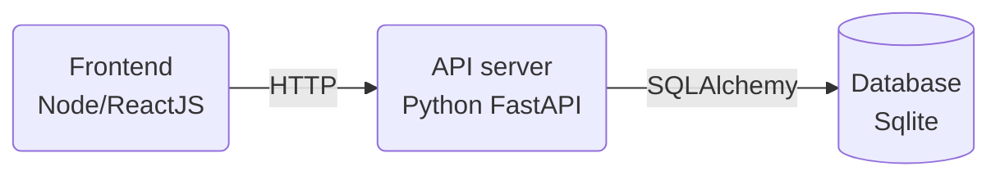

## Scenario
This is a relatively simple prototype chatbot app someone has created.
It consists of a python backend API server,
an SQL database that the backend reads and writes to,
and a ReactJS frontend that talks to the backend via HTTP.

However, the app author only knows how to develop on their local computer,
and needs help getting the app into production on the internet. 



### Local setup
The versions of Python and NodeJS that need to be installed on the system are listed in `.tool-versions`.

The database is just a `sqlite` file in the filesystem.
When developing locally the Python app handles access, so there is no need to run the DB as a separate process.
But this may be a poor choice of database for production,
and it might be necessary to migrate the data into some other DB.

#### Backend
The backend uses the `pipenv` package manager, which should be installed for the global python with `pip install --user pipenv`.

To install Python app dependencies locally:
```shell
pipenv sync
```

To run the backend from the project root:
```shell
pipenv run uvicorn backend.app:app --reload
```

#### Frontend
The frontend app uses `npm` to install the app dependencies in the `frontend/` directory.

To install NodeJS app dependencies locally:
```shell
cd frontend/
npm ci
```

To run the frontend from the `frontend/` directory:
```shell
cd frontend/
npm start
```
